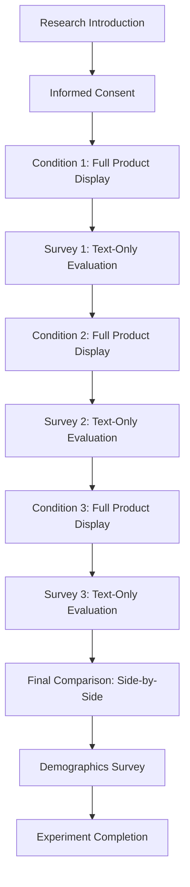

# AI Gift Recommendation Explanation Evaluation System

[](https://www.typescriptlang.org/)
[](https://reactjs.org/)
[](https://nodejs.org/)
[](https://www.postgresql.org/)
[](https://openai.com/)

> **A within-subject experimental platform for evaluating AI-generated gift recommendation explanations using Latin Square design**

This research platform measures user responses to three types of AI-generated gift recommendation explanations through cognitive UX scales, providing insights into the effectiveness of different explanation strategies in e-commerce contexts.

## 🎯 Research Objectives

- **Comparative Analysis**: Evaluate three distinct explanation types for AI gift recommendations
- **Cognitive Load Assessment**: Measure user comprehension, information overload, and perceived fit
- **Purchase Intent Impact**: Analyze how explanation types influence buying decisions
- **Manipulation Check Validation**: Ensure participants correctly identify explanation characteristics

## 🔬 Experimental Design

### Within-Subject Design
- **Participants**: Each user experiences all three explanation conditions
- **Latin Square Ordering**: 6 balanced presentation sequences (ABC, ACB, BAC, BCA, CAB, CBA)
- **Controlled Variables**: Fixed product (30,000 KRW), consistent friend persona
- **Dependent Variables**: Cognitive load, trust, usefulness, satisfaction, purchase intent

### Explanation Types

| Type | Focus | Key Features |
|------|-------|-------------|
| **A. Feature-Focused** | Product specifications | Objective product attributes, technical details |
| **B. Profile-Based** | User demographics | Age/gender statistics, behavioral patterns |
| **C. Context-Based** | Gift intention | Emotional context, relationship significance |

## 📋 Experimental Flow



## 🛠 Technical Architecture

### Frontend Stack
- **React 18** + TypeScript
- **Vite** for development and build
- **Shadcn/ui** + Tailwind CSS for UI components
- **Wouter** for client-side routing
- **TanStack Query** for server state management
- **React Hook Form** + Zod for form validation

### Backend Stack
- **Node.js** + Express.js
- **TypeScript** with ES modules
- **Drizzle ORM** + PostgreSQL
- **OpenAI GPT-5** API integration
- **Session management** with PostgreSQL store

### AI Integration
- **Model**: OpenAI GPT-5 with reasoning API
- **Prompt Engineering**: XML-structured templates
- **Performance**: Parallel generation with Promise.all
- **Image Generation**: DALL-E 3 for product visuals
- **Response Optimization**: Minimal reasoning effort for speed

## 📊 Data Collection

### Survey Instruments

#### Main Experiment Surveys (3x per participant)
- **Comprehension** (4 items): Understanding clarity and completeness
- **Information Overload** (4 items): Cognitive processing difficulty
- **Perceived Fit** (3 items): Product-situation appropriateness  
- **Purchase Intent** (3 items): Likelihood to buy and recommend
- **Manipulation Checks** (2 items): Explanation type identification

#### Final Comparison Survey
- **Preference Ranking**: Order all three explanations
- **Reason Attribution**: Open-ended preference justification
- **Confidence Level**: 7-point certainty scale

#### Demographics Survey
- **Basic Information**: Age, gender, phone number
- **Gift Shopping Frequency**: 5-point scale
- **KakaoTalk Gift Service Evaluation** (7-point scales):
  - Price appropriateness
  - Product quality and reliability
  - **Taste appropriateness**: Fit with recipient preferences
  - **Relationship intimacy**: Closeness consideration
- **Usage Experience**: Past behavior and gift situations
- **Gift Mindset**: Approach to gift-giving

### Behavioral Data
- **Click Events**: User interaction tracking
- **Response Times**: Task completion duration
- **Navigation Patterns**: Step-by-step progression

## 🎨 UI/UX Features

### Visual Design
- **Explanation Differentiation**: Color-coded borders (Feature: Gray, Profile: Blue, Context: Red)
- **Readability Optimization**: 16px font size, white backgrounds
- **Responsive Layout**: Desktop (55:45 ratio) and mobile optimized
- **Accessibility**: High contrast, clear navigation

### User Experience
- **Progress Indicators**: Clear step tracking
- **Loading States**: Feedback during AI generation
- **Error Handling**: Graceful failure recovery
- **Data Validation**: Real-time form validation

## 🧪 Recent Updates

### AI Prompt Improvements
- **Profile-Based Accuracy**: Enhanced prompts ensure demographic statistics match recipient characteristics
- **Context-Based Formatting**: Limited bold text to exactly 4 key terms for better readability
- **Manipulation Check Clarity**: Updated MC1 question to "Contains statistical information"

### Survey Enhancements
- **Expanded Demographics**: Added relationship intimacy factor for gift consideration
- **Terminology Refinement**: Changed "relationship appropriateness" to "taste appropriateness"
- **Question Consistency**: Standardized all manipulation checks to Yes/No format

## 🚀 Getting Started

### Prerequisites
- Node.js 18+ 
- PostgreSQL database
- OpenAI API key

### Installation

1. **Clone the repository**
```bash
git clone <repository-url>
cd ai-gift-recommendation-study
```

2. **Install dependencies**
```bash
npm install
```

3. **Environment setup**
```bash
# Create .env file with:
DATABASE_URL=your_postgresql_connection_string
OPENAI_API_KEY=your_openai_api_key
```

4. **Database initialization**
```bash
npm run db:push
```

5. **Start development server**
```bash
npm run dev
```

The application will be available at `http://localhost:5000`

## 📁 Project Structure

```
├── client/                 # React frontend
│   ├── src/
│   │   ├── components/     # Reusable UI components
│   │   ├── pages/         # Route components
│   │   ├── lib/           # Utilities and configurations
│   │   └── hooks/         # Custom React hooks
├── server/                # Express backend
│   ├── routes.ts         # API endpoints
│   ├── services/         # Business logic
│   └── storage.ts        # Data access layer
├── shared/               # Shared types and schemas
│   └── schema.ts        # Database and validation schemas
└── README.md            # This file
```

## 🔄 API Endpoints

### Experiment Management
| Method | Endpoint | Description |
|--------|----------|-------------|
| POST | `/api/experiment/start` | Initialize new experiment session |
| GET | `/api/experiment/:id` | Retrieve experiment data |
| PATCH | `/api/experiment/:id/step` | Update experiment progress |

### Data Collection
| Method | Endpoint | Description |
|--------|----------|-------------|
| POST | `/api/experiment/:id/survey` | Save survey responses |
| POST | `/api/experiment/:id/comparison` | Save final comparison |
| POST | `/api/experiment/:id/demographics` | Save participant info |
| POST | `/api/experiment/:id/click-event` | Log user interactions |

## 📈 Database Schema

### Core Tables
- **experiments**: Session metadata and configurations
- **survey_responses**: Main experimental data
- **final_comparisons**: Preference rankings and reasoning
- **demographics**: Participant characteristics
- **click_events**: Behavioral interaction logs

## 🔬 Research Applications

This platform supports research in:
- **Human-Computer Interaction**: AI explanation interfaces
- **Consumer Psychology**: Purchase decision factors
- **Information Systems**: Recommendation system design
- **UX Research**: Cognitive load in digital environments

## 📋 Ethical Considerations

- **Informed Consent**: Required before participation
- **Data Privacy**: Encrypted personal information storage
- **Research Use Only**: Data limited to academic purposes
- **Anonymization**: Personal identifiers removed from analysis

## 🤝 Contributing

This is a research project. For questions about the methodology or technical implementation, please contact the research team.

## 📄 License

This project is intended for research purposes only. Commercial use is not permitted.

## 📞 Support

For technical issues or research inquiries, please refer to the project documentation or contact the development team.

---

**Built with ❤️ for AI/HCI research**